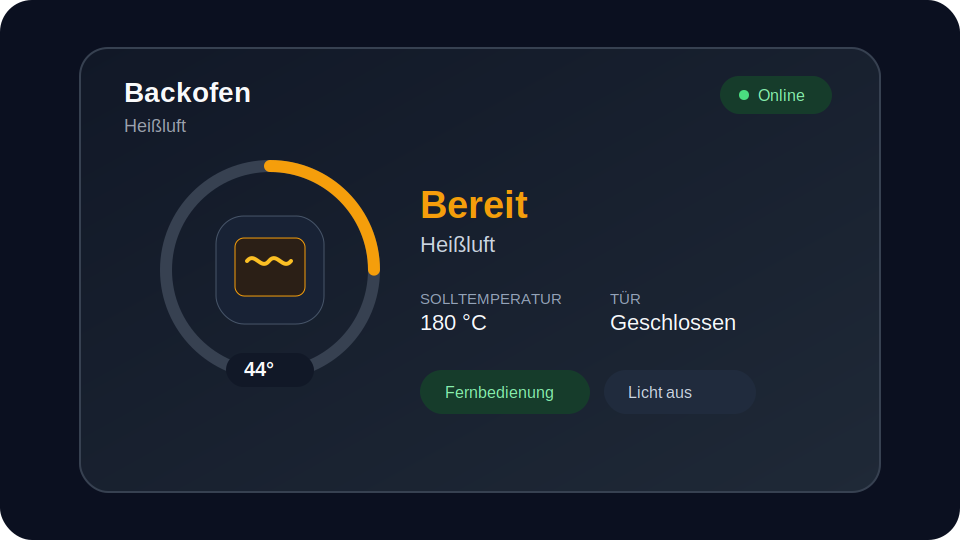

# Home Connect Oven Card

A standalone Home Assistant dashboard card for Home Connect ovens.



## Features

- Automatic Home Connect entity discovery from a Home Assistant `device_id`
- Current temperature, target temperature, operation state, programme, progress and finish time
- Door, connectivity, remote-control, remote-start, local-control and interior-light status
- Programme selection and target-temperature control
- Duration, delayed-start and timer presets
- Fast-preheat, pause and confirmed programme-stop controls
- Responsive layout with reduced-motion support
- German and English labels
- No frontend-card dependencies

Direct power-on and remote-start actions are deliberately not provided.

## Compatibility

This card has been tested with a **Siemens iQ700 oven** using the Home Connect integration. It should also work with other Home Connect ovens that expose the corresponding standard entities. Available controls and status fields depend on the capabilities and enabled entities of the individual appliance.

## Installation

### HACS

1. Open HACS.
2. Add this repository as a custom repository with category **Dashboard**.
3. Install **Home Connect Oven Card**.
4. Reload the browser.

HACS installs the resource as:

```text
/hacsfiles/homeassistant_custom_oven_card/homeassistant_custom_oven_card.js
```

### Manual

Copy `dist/homeassistant_custom_oven_card.js` to Home Assistant and register it as a JavaScript module.

## Configuration

```yaml
type: custom:oven-card
device_id: 0123456789abcdef0123456789abcdef
title: Backofen
```

The card discovers the Home Connect entities attached to the device. Entity IDs can also be supplied explicitly:

```yaml
type: custom:oven-card
title: Backofen
entities:
  operation: sensor.backofen_operation_state
  currentTemperature: sensor.backofen_current_oven_cavity_temperature
  setpoint: number.backofen_setpoint_temperature
  selectedProgram: select.backofen_selected_program
  progress: sensor.backofen_program_progress
  finish: sensor.backofen_program_finish_time
  door: sensor.backofen_door
  connectivity: binary_sensor.backofen_connectivity
```

Optional settings:

```yaml
type: custom:oven-card
device_id: 0123456789abcdef0123456789abcdef
accent_color: '#f57c00'
show_program: true
show_temperature: true
show_duration: true
show_delay: true
show_timer: true
show_options: true
program_names:
  cooking_oven_program_heating_mode_hot_air: Heißluft
```

## Requirements

- Home Assistant with the Home Connect integration configured
- The relevant entities must be enabled in the entity registry

## Development

```bash
npm ci
npm test
npm run build
```

`npm run build` validates the source and writes the HACS distribution file.

## Release process

1. Update `CHANGELOG.md` and the version in `package.json`.
2. Run the Jenkins and GitHub Actions validation pipelines.
3. Run the **Release** workflow with a semantic version such as `v0.2.0`.
4. Confirm that the HACS validation workflow passes against the release.

## Support

Use GitHub Issues for bug reports and feature requests. Security issues should follow [SECURITY.md](SECURITY.md).

## License

MIT
