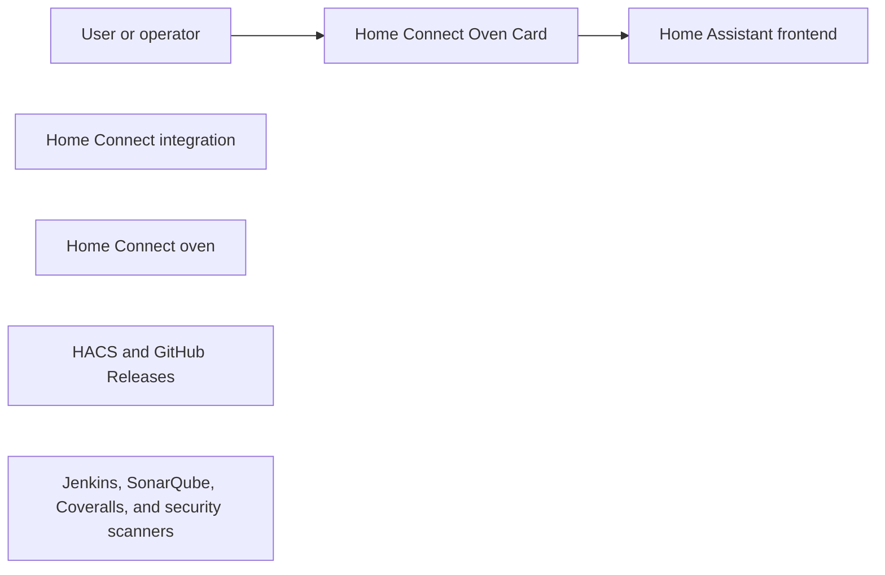

# System context diagram

```mermaid
flowchart LR
    User["User or operator"] --> Project["Home Connect Oven Card"]
    External1["Home Assistant frontend"]
    External2["Home Connect integration"]
    External3["Home Connect oven"]
    External4["HACS and GitHub Releases"]
    External5["Jenkins, SonarQube, Coveralls, and security scanners"]
    Project --> External1
```
